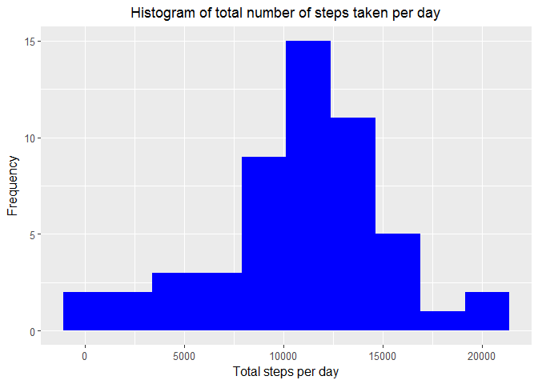
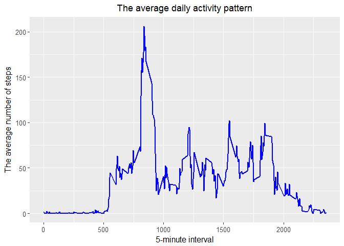
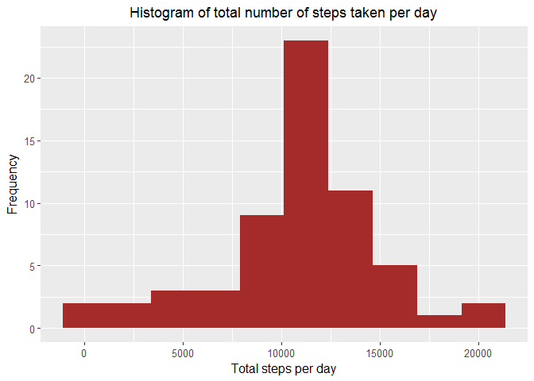
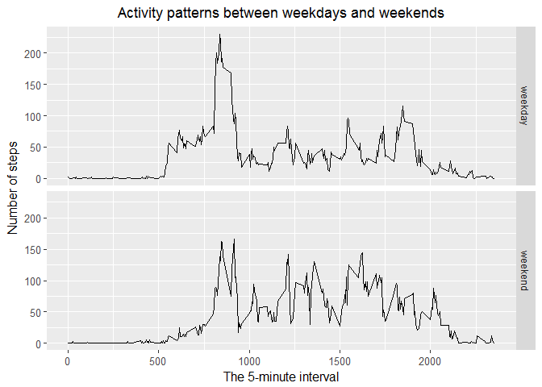

**All the instructions of this assignment available from [Forked repository on GitHub](https://github.com/Meiyalaghan/RepData_PeerAssessment1)**


```r
rm(list=ls())
```


##1. What is mean total number of steps taken per day?

**Load require libraries**

```r
#load require libraries
library(data.table) # required for 'fread'
library(magrittr) #required to use the pipe (%>%) operator
library(dplyr)
```

```
## 
## Attaching package: 'dplyr'
```

```
## The following objects are masked from 'package:data.table':
## 
##     between, first, last
```

```
## The following objects are masked from 'package:stats':
## 
##     filter, lag
```

```
## The following objects are masked from 'package:base':
## 
##     intersect, setdiff, setequal, union
```

```r
library(ggplot2)
```


**Reading data**

```r
## assign data folder to get required file
FileGetDir <- "./Data/"

#read raw data
rawData <- fread(paste0(FileGetDir,"activity.csv"), header=T, sep=",")
```


**Inspecting loaded data**

```r
## A freshly read data.frame should always be inspected with functions such as head, str, summary and tail
head(rawData)
```

```
##    steps       date interval
## 1:    NA 2012-10-01        0
## 2:    NA 2012-10-01        5
## 3:    NA 2012-10-01       10
## 4:    NA 2012-10-01       15
## 5:    NA 2012-10-01       20
## 6:    NA 2012-10-01       25
```

```r
str(rawData)
```

```
## Classes 'data.table' and 'data.frame':	17568 obs. of  3 variables:
##  $ steps   : int  NA NA NA NA NA NA NA NA NA NA ...
##  $ date    : chr  "2012-10-01" "2012-10-01" "2012-10-01" "2012-10-01" ...
##  $ interval: int  0 5 10 15 20 25 30 35 40 45 ...
##  - attr(*, ".internal.selfref")=<externalptr>
```

```r
summary(rawData)
```

```
##      steps            date              interval     
##  Min.   :  0.00   Length:17568       Min.   :   0.0  
##  1st Qu.:  0.00   Class :character   1st Qu.: 588.8  
##  Median :  0.00   Mode  :character   Median :1177.5  
##  Mean   : 37.38                      Mean   :1177.5  
##  3rd Qu.: 12.00                      3rd Qu.:1766.2  
##  Max.   :806.00                      Max.   :2355.0  
##  NA's   :2304
```

**Converting date variable to date class**

```r
#convert date variable (currently in chr class) to date class
processedData <- rawData
processedData$date <- as.POSIXct(processedData$date)
str(processedData) #check df
```

```
## Classes 'data.table' and 'data.frame':	17568 obs. of  3 variables:
##  $ steps   : int  NA NA NA NA NA NA NA NA NA NA ...
##  $ date    : POSIXct, format: "2012-10-01" "2012-10-01" ...
##  $ interval: int  0 5 10 15 20 25 30 35 40 45 ...
##  - attr(*, ".internal.selfref")=<externalptr>
```


### 1.1 Make a histogram of the total number of steps taken each day
**Calculate sum and mean values of steps taken each day**

```r
 processedData_steps <- processedData %>%
    na.omit() %>% # ignore the missing values in the dataset
    group_by(date) %>% # group dataset by date variable
    summarise(total_steps = sum(steps)) #summarise grouped data for sum and mean values of steps
```


**construct the histogram the total number of steps per day**

```r
processedData_steps %>%
    ggplot(aes(x=total_steps)) + 
        geom_histogram(fill = "blue", binwidth = 2250) + #use appropriate binwidth 
        theme(axis.text = element_text(size = 10), axis.title = element_text(size = 12)) +
        labs(title = "Histogram of total number of steps taken per day",
                 y = "Frequency",
                 x = "Total steps per day") + 
        theme(plot.title = element_text(hjust = 0.5)) #to centre the Plot title in ggplot2
```

<!-- -->

### 1.2 Calculate and report the mean and median total number of steps taken per day

```r
summary(processedData_steps$total_steps)
```

```
##    Min. 1st Qu.  Median    Mean 3rd Qu.    Max. 
##      41    8841   10765   10766   13294   21194
```

*The mean is 10766 and median is 10766*


##2. What is the average daily activity pattern?


###2.1 Make a time series plot of the 5-minute interval (x-axis) and the average number of steps taken, averaged across all days (y-axis)

**Calculate the average number of steps per each 5-minute interval **

```r
 processedData_interval <- rawData %>%
    na.omit() %>% # ignore the missing values in the dataset
    group_by(interval) %>% # group dataset by date variable
    summarise(mean_steps = mean(steps)) #summarise grouped data for mean values of steps
```


**construct the line plot am the total number of steps per day**

```r
processedData_interval %>%
    ggplot(aes(x=interval, y = mean_steps)) + 
        geom_line(color="blue", size=1) +  
        theme(axis.text = element_text(size = 10), axis.title = element_text(size = 12)) +
        labs(title = "The average daily activity pattern",
                 y = "The average number of steps",
                 x = "5-minute interval") + 
        theme(plot.title = element_text(hjust = 0.5)) #to centre the Plot title in ggplot2
```

<!-- -->


### 2.2 Which 5-minute interval, on average across all the days in the dataset, contains the maximum number of steps?


```r
 find_max_interval <- processedData_interval[which.max(processedData_interval$mean_steps), ]
find_max_interval
```

```
## # A tibble: 1 x 2
##   interval mean_steps
##      <int>      <dbl>
## 1      835       206.
```

*The 835th of the 5-minute interval interval has maximum 206 number of steps.*


##3. Imputing missing values

###3.1 Calculate and report the total number of missing values in the dataset (i.e. the total number of rows with NAs)

**Detecting missing values in a `data.frame`**

```r
#Calculate missing values
sapply(rawData, function(x) sum(is.na(x)))
```

```
##    steps     date interval 
##     2304        0        0
```

*The total number of missing values in the dataset is 2304 (i.e rows with NAs).*


###3.2 Devise a strategy for filling in all of the missing values in the dataset. The strategy does not need to be sophisticated. For example, you could use the mean/median for that day, or the mean for that 5-minute interval, etc.

I've selected the mean for the 5-minute interval for filling NAs in the dataset.

```r
#merge date transformed df and mean per interval df
df_merge_interval  <- merge(x=processedData, y=processedData_interval, by="interval")


#test that if NA found in variable `steps` then give value of `mean_steps` otherwise keep the existing value of 'steps'.
df_merge_interval$steps <- ifelse(test = is.na(df_merge_interval$steps), yes = df_merge_interval$mean_steps, no = df_merge_interval$steps)

sapply(df_merge_interval, function(x) sum(is.na(x))) # just to check NAs again
```

```
##   interval      steps       date mean_steps 
##          0          0          0          0
```


### 3.3 Create a new dataset that is equal to the original dataset but with the missing data filled in.

```r
#subset df with selected columns 
df_NA.filled <- subset(df_merge_interval, select = c("steps", "date", "interval"))
```


### 3.4 Make a histogram of the total number of steps taken each day and Calculate and report the mean and median total number of steps taken per day. Do these values differ from the estimates from the first part of the assignment? What is the impact of imputing missing data on the estimates of the total daily number of steps?

* A histogram of the total number of steps taken each day

```r
#calculate the total number of steps taken each day
 df_NA.filled_tot.steps <- df_NA.filled %>%
    group_by(date) %>% # group dataset by date to calculate steps taken each day
    summarise(total_steps = sum(steps))   #summarise grouped data for sum value of steps
    
# Make a histogram
 df_NA.filled_tot.steps %>%
    ggplot(aes(x=total_steps)) + 
        geom_histogram(fill = "brown", binwidth = 2250) + #use appropriate binwidth 
        theme(axis.text = element_text(size = 10), axis.title = element_text(size = 12)) +
        labs(title = "Histogram of total number of steps taken per day",
                 y = "Frequency",
                 x = "Total steps per day") + 
        theme(plot.title = element_text(hjust = 0.5)) #to centre the Plot title in ggplot2
```

<!-- -->

** The mean and median total number of steps taken per day**

```r
# calculate the mean and median total number of steps taken per day
 summary(df_NA.filled_tot.steps$total_steps) 
```

```
##    Min. 1st Qu.  Median    Mean 3rd Qu.    Max. 
##      41    9819   10766   10766   12811   21194
```

* Do these values differ from the estimates from the first part of the assignment?

*Yes*

* What is the impact of imputing missing data on the estimates of the total daily number of steps?

*Before imputing missing data the median and mean were 10765 and 10766 respectively.*
*After imputing missing data the median and mean were 10766 and 10766 respectively Thus, after imputation, median value has been shifted towards mean value*

## 4. Are there differences in activity patterns between weekdays and weekends?
For this part the weekdays() function may be of some help here. Use the dataset with the filled-in missing values for this part.

### 4.1 Create a new factor variable in the dataset with two levels -- "weekday" and "weekend" indicating whether a given date is a weekday or weekend day.


```r
#make a df with a new factor variable
df_date.day <- df_NA.filled %>%
    mutate(date.day = weekdays(date)) %>% #create a new variable 'date_day' with  extracted the weekday
    mutate(date.day = ifelse(date.day=="Saturday" | date.day == "Sunday", yes = "weekend", no = "weekday")) %>% #mutete Saturday and Sunday as `weekend` and rest of the days as `weekday`
    mutate(date.day = factor(date.day)) 

str(df_date.day) #check dataset
```

```
## 'data.frame':	17568 obs. of  4 variables:
##  $ steps   : num  1.72 0 0 47 0 ...
##  $ date    : POSIXct, format: "2012-10-01" "2012-10-02" ...
##  $ interval: int  0 0 0 0 0 0 0 0 0 0 ...
##  $ date.day: Factor w/ 2 levels "weekday","weekend": 1 1 1 1 1 2 2 1 1 1 ...
```

### 4.2 Make a panel plot containing a time series plot (i.e. type = "l") of the 5-minute interval (x-axis) and the average number of steps taken, averaged across all weekday days or weekend days (y-axis). The plot should look something like the following, which was created using simulated data:


```r
#calculate the average number of steps taken
df_day.meanSteps <- df_date.day %>%
    select(steps, interval, date.day) %>% 
    group_by(interval, date.day) %>% 
    summarise(day.meanSteps = mean(steps))

#Make a panel plot
plot <- df_day.meanSteps %>% 
    ggplot(aes(x=interval, y=day.meanSteps)) + 
        geom_line() +
        facet_grid(date.day~.) +
        theme(axis.text = element_text(size = 10), axis.title = element_text(size = 12)) +
        labs(title = "Activity patterns between weekdays and weekends",
                 y = "Number of steps",
                 x = "The 5-minute interval") + 
        theme(plot.title = element_text(hjust = 0.5)) #to centre the Plot title in ggplot2
plot
```

<!-- -->

