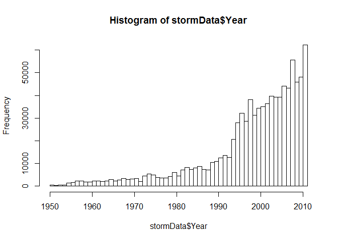

Analysing the U.S. National Oceanic and Atmospheric Administration’s storm database to find the severe weather events
================
S. Meiyalaghan
2018-07-27

-   [Synopsis](#synopsis)
-   [Data Processing](#data-processing)
    -   [Key processes:](#key-processes)
    -   [Download the file](#download-the-file)
    -   [Read and inspect the data](#read-and-inspect-the-data)
    -   [Converting date variable to date format and create a new variable for years](#converting-date-variable-to-date-format-and-create-a-new-variable-for-years)
    -   [Visualisation of storm data distribution](#visualisation-of-storm-data-distribution)
-   [Results](#results)
    -   [Tyeps of weather events across the United States that are most harmful with respect to population health](#tyeps-of-weather-events-across-the-united-states-that-are-most-harmful-with-respect-to-population-health)
    -   [Tyeps of weather events across the United States that have greatest economic consequences](#tyeps-of-weather-events-across-the-united-states-that-have-greatest-economic-consequences)

Synopsis
--------

The U.S. National Oceanic and Atmospheric Administration’s (NOAA) storm database was explored to find the severe weather events. This data analysis has been performed in partial fulfillment of the requirements for the [Reproducible Research](https://www.coursera.org/learn/reproducible-research) course available online from Johns Hopkins University via Coursera. In this analysis, dataset from the year 1995 was taken into account following the visualisation of data distribution (Figure). The fifteen most harmful weather events with respect to population health across the United States have been identified, mainly based on the number of fatalities, and listed in Table 1. Furthermore, the fifteen weather events that have greatest economic consequences across the United States have been identified, mainly based on the property damaged, and listed in Table 2.

Data Processing
---------------

#### Key processes:

-   Load required libraries to perform this analysis

-   Download the storm data The details of constructed/defined variables in the storm data were obtained from the following documentation

1.  [National Weather Service Storm Data Documentation](https://d396qusza40orc.cloudfront.net/repdata%2Fpeer2_doc%2Fpd01016005curr.pdffiles)

2.  [National Climatic Data Center Storm Events FAQ](https://www.ncdc.noaa.gov/stormevents/faq.jsp)

-   Read and inspect the downloaded data

-   Convert the variable to the right format

-   Create a new variable called 'Year'

-   Visualise the storm data distribution

**Load required libraries**

``` r
#load require libraries
library(data.table) # required for 'fread'
library(magrittr) #required to use the pipe (%>%) operator
library(dplyr) # for efficiently manipulating datasets
```

    ## 
    ## Attaching package: 'dplyr'

    ## The following objects are masked from 'package:data.table':
    ## 
    ##     between, first, last

    ## The following objects are masked from 'package:stats':
    ## 
    ##     filter, lag

    ## The following objects are masked from 'package:base':
    ## 
    ##     intersect, setdiff, setequal, union

``` r
library(pander) # to produce good tables
```

#### Download the file

``` r
# create a local directory named "data" if not exsits to download the file 
localDir <- "data"
if (!file.exists(localDir)) {
  dir.create(localDir)
}

# download the file if not exsits
url <- "https://d396qusza40orc.cloudfront.net/repdata%2Fdata%2FStormData.csv.bz2"
stormData_file <- paste(localDir, basename(url), sep='/')
if (!file.exists(stormData_file)) {
  download.file(url, stormData_file)
}
```

#### Read and inspect the data

``` r
#read the data
stormData <- read.csv(stormData_file, as.is = TRUE)

# A freshly read data.frame should always be inspected with functions such as head, str, summary and tail

head(stormData)
```

    ##   STATE__           BGN_DATE BGN_TIME TIME_ZONE COUNTY COUNTYNAME STATE
    ## 1       1  4/18/1950 0:00:00     0130       CST     97     MOBILE    AL
    ## 2       1  4/18/1950 0:00:00     0145       CST      3    BALDWIN    AL
    ## 3       1  2/20/1951 0:00:00     1600       CST     57    FAYETTE    AL
    ## 4       1   6/8/1951 0:00:00     0900       CST     89    MADISON    AL
    ## 5       1 11/15/1951 0:00:00     1500       CST     43    CULLMAN    AL
    ## 6       1 11/15/1951 0:00:00     2000       CST     77 LAUDERDALE    AL
    ##    EVTYPE BGN_RANGE BGN_AZI BGN_LOCATI END_DATE END_TIME COUNTY_END
    ## 1 TORNADO         0                                               0
    ## 2 TORNADO         0                                               0
    ## 3 TORNADO         0                                               0
    ## 4 TORNADO         0                                               0
    ## 5 TORNADO         0                                               0
    ## 6 TORNADO         0                                               0
    ##   COUNTYENDN END_RANGE END_AZI END_LOCATI LENGTH WIDTH F MAG FATALITIES
    ## 1         NA         0                      14.0   100 3   0          0
    ## 2         NA         0                       2.0   150 2   0          0
    ## 3         NA         0                       0.1   123 2   0          0
    ## 4         NA         0                       0.0   100 2   0          0
    ## 5         NA         0                       0.0   150 2   0          0
    ## 6         NA         0                       1.5   177 2   0          0
    ##   INJURIES PROPDMG PROPDMGEXP CROPDMG CROPDMGEXP WFO STATEOFFIC ZONENAMES
    ## 1       15    25.0          K       0                                    
    ## 2        0     2.5          K       0                                    
    ## 3        2    25.0          K       0                                    
    ## 4        2     2.5          K       0                                    
    ## 5        2     2.5          K       0                                    
    ## 6        6     2.5          K       0                                    
    ##   LATITUDE LONGITUDE LATITUDE_E LONGITUDE_ REMARKS REFNUM
    ## 1     3040      8812       3051       8806              1
    ## 2     3042      8755          0          0              2
    ## 3     3340      8742          0          0              3
    ## 4     3458      8626          0          0              4
    ## 5     3412      8642          0          0              5
    ## 6     3450      8748          0          0              6

``` r
str(stormData)
```

    ## 'data.frame':    902297 obs. of  37 variables:
    ##  $ STATE__   : num  1 1 1 1 1 1 1 1 1 1 ...
    ##  $ BGN_DATE  : chr  "4/18/1950 0:00:00" "4/18/1950 0:00:00" "2/20/1951 0:00:00" "6/8/1951 0:00:00" ...
    ##  $ BGN_TIME  : chr  "0130" "0145" "1600" "0900" ...
    ##  $ TIME_ZONE : chr  "CST" "CST" "CST" "CST" ...
    ##  $ COUNTY    : num  97 3 57 89 43 77 9 123 125 57 ...
    ##  $ COUNTYNAME: chr  "MOBILE" "BALDWIN" "FAYETTE" "MADISON" ...
    ##  $ STATE     : chr  "AL" "AL" "AL" "AL" ...
    ##  $ EVTYPE    : chr  "TORNADO" "TORNADO" "TORNADO" "TORNADO" ...
    ##  $ BGN_RANGE : num  0 0 0 0 0 0 0 0 0 0 ...
    ##  $ BGN_AZI   : chr  "" "" "" "" ...
    ##  $ BGN_LOCATI: chr  "" "" "" "" ...
    ##  $ END_DATE  : chr  "" "" "" "" ...
    ##  $ END_TIME  : chr  "" "" "" "" ...
    ##  $ COUNTY_END: num  0 0 0 0 0 0 0 0 0 0 ...
    ##  $ COUNTYENDN: logi  NA NA NA NA NA NA ...
    ##  $ END_RANGE : num  0 0 0 0 0 0 0 0 0 0 ...
    ##  $ END_AZI   : chr  "" "" "" "" ...
    ##  $ END_LOCATI: chr  "" "" "" "" ...
    ##  $ LENGTH    : num  14 2 0.1 0 0 1.5 1.5 0 3.3 2.3 ...
    ##  $ WIDTH     : num  100 150 123 100 150 177 33 33 100 100 ...
    ##  $ F         : int  3 2 2 2 2 2 2 1 3 3 ...
    ##  $ MAG       : num  0 0 0 0 0 0 0 0 0 0 ...
    ##  $ FATALITIES: num  0 0 0 0 0 0 0 0 1 0 ...
    ##  $ INJURIES  : num  15 0 2 2 2 6 1 0 14 0 ...
    ##  $ PROPDMG   : num  25 2.5 25 2.5 2.5 2.5 2.5 2.5 25 25 ...
    ##  $ PROPDMGEXP: chr  "K" "K" "K" "K" ...
    ##  $ CROPDMG   : num  0 0 0 0 0 0 0 0 0 0 ...
    ##  $ CROPDMGEXP: chr  "" "" "" "" ...
    ##  $ WFO       : chr  "" "" "" "" ...
    ##  $ STATEOFFIC: chr  "" "" "" "" ...
    ##  $ ZONENAMES : chr  "" "" "" "" ...
    ##  $ LATITUDE  : num  3040 3042 3340 3458 3412 ...
    ##  $ LONGITUDE : num  8812 8755 8742 8626 8642 ...
    ##  $ LATITUDE_E: num  3051 0 0 0 0 ...
    ##  $ LONGITUDE_: num  8806 0 0 0 0 ...
    ##  $ REMARKS   : chr  "" "" "" "" ...
    ##  $ REFNUM    : num  1 2 3 4 5 6 7 8 9 10 ...

``` r
summary(stormData)
```

    ##     STATE__       BGN_DATE           BGN_TIME          TIME_ZONE        
    ##  Min.   : 1.0   Length:902297      Length:902297      Length:902297     
    ##  1st Qu.:19.0   Class :character   Class :character   Class :character  
    ##  Median :30.0   Mode  :character   Mode  :character   Mode  :character  
    ##  Mean   :31.2                                                           
    ##  3rd Qu.:45.0                                                           
    ##  Max.   :95.0                                                           
    ##                                                                         
    ##      COUNTY       COUNTYNAME           STATE              EVTYPE         
    ##  Min.   :  0.0   Length:902297      Length:902297      Length:902297     
    ##  1st Qu.: 31.0   Class :character   Class :character   Class :character  
    ##  Median : 75.0   Mode  :character   Mode  :character   Mode  :character  
    ##  Mean   :100.6                                                           
    ##  3rd Qu.:131.0                                                           
    ##  Max.   :873.0                                                           
    ##                                                                          
    ##    BGN_RANGE          BGN_AZI           BGN_LOCATI       
    ##  Min.   :   0.000   Length:902297      Length:902297     
    ##  1st Qu.:   0.000   Class :character   Class :character  
    ##  Median :   0.000   Mode  :character   Mode  :character  
    ##  Mean   :   1.484                                        
    ##  3rd Qu.:   1.000                                        
    ##  Max.   :3749.000                                        
    ##                                                          
    ##    END_DATE           END_TIME           COUNTY_END COUNTYENDN    
    ##  Length:902297      Length:902297      Min.   :0    Mode:logical  
    ##  Class :character   Class :character   1st Qu.:0    NA's:902297   
    ##  Mode  :character   Mode  :character   Median :0                  
    ##                                        Mean   :0                  
    ##                                        3rd Qu.:0                  
    ##                                        Max.   :0                  
    ##                                                                   
    ##    END_RANGE          END_AZI           END_LOCATI       
    ##  Min.   :  0.0000   Length:902297      Length:902297     
    ##  1st Qu.:  0.0000   Class :character   Class :character  
    ##  Median :  0.0000   Mode  :character   Mode  :character  
    ##  Mean   :  0.9862                                        
    ##  3rd Qu.:  0.0000                                        
    ##  Max.   :925.0000                                        
    ##                                                          
    ##      LENGTH              WIDTH                F               MAG         
    ##  Min.   :   0.0000   Min.   :   0.000   Min.   :0.0      Min.   :    0.0  
    ##  1st Qu.:   0.0000   1st Qu.:   0.000   1st Qu.:0.0      1st Qu.:    0.0  
    ##  Median :   0.0000   Median :   0.000   Median :1.0      Median :   50.0  
    ##  Mean   :   0.2301   Mean   :   7.503   Mean   :0.9      Mean   :   46.9  
    ##  3rd Qu.:   0.0000   3rd Qu.:   0.000   3rd Qu.:1.0      3rd Qu.:   75.0  
    ##  Max.   :2315.0000   Max.   :4400.000   Max.   :5.0      Max.   :22000.0  
    ##                                         NA's   :843563                    
    ##    FATALITIES          INJURIES            PROPDMG       
    ##  Min.   :  0.0000   Min.   :   0.0000   Min.   :   0.00  
    ##  1st Qu.:  0.0000   1st Qu.:   0.0000   1st Qu.:   0.00  
    ##  Median :  0.0000   Median :   0.0000   Median :   0.00  
    ##  Mean   :  0.0168   Mean   :   0.1557   Mean   :  12.06  
    ##  3rd Qu.:  0.0000   3rd Qu.:   0.0000   3rd Qu.:   0.50  
    ##  Max.   :583.0000   Max.   :1700.0000   Max.   :5000.00  
    ##                                                          
    ##   PROPDMGEXP           CROPDMG         CROPDMGEXP       
    ##  Length:902297      Min.   :  0.000   Length:902297     
    ##  Class :character   1st Qu.:  0.000   Class :character  
    ##  Mode  :character   Median :  0.000   Mode  :character  
    ##                     Mean   :  1.527                     
    ##                     3rd Qu.:  0.000                     
    ##                     Max.   :990.000                     
    ##                                                         
    ##      WFO             STATEOFFIC         ZONENAMES            LATITUDE   
    ##  Length:902297      Length:902297      Length:902297      Min.   :   0  
    ##  Class :character   Class :character   Class :character   1st Qu.:2802  
    ##  Mode  :character   Mode  :character   Mode  :character   Median :3540  
    ##                                                           Mean   :2875  
    ##                                                           3rd Qu.:4019  
    ##                                                           Max.   :9706  
    ##                                                           NA's   :47    
    ##    LONGITUDE        LATITUDE_E     LONGITUDE_       REMARKS         
    ##  Min.   :-14451   Min.   :   0   Min.   :-14455   Length:902297     
    ##  1st Qu.:  7247   1st Qu.:   0   1st Qu.:     0   Class :character  
    ##  Median :  8707   Median :   0   Median :     0   Mode  :character  
    ##  Mean   :  6940   Mean   :1452   Mean   :  3509                     
    ##  3rd Qu.:  9605   3rd Qu.:3549   3rd Qu.:  8735                     
    ##  Max.   : 17124   Max.   :9706   Max.   :106220                     
    ##                   NA's   :40                                        
    ##      REFNUM      
    ##  Min.   :     1  
    ##  1st Qu.:225575  
    ##  Median :451149  
    ##  Mean   :451149  
    ##  3rd Qu.:676723  
    ##  Max.   :902297  
    ## 

#### Converting date variable to date format and create a new variable for years

``` r
#convert date variable named 'BGN_DATE'  to `Date` format, then extract and list the years in a  newly created variable called 'Year'.
stormData$Year <- year(as.Date(stormData$BGN_DATE, '%m/%d/%Y'))

range(stormData$Year) # to see the start and end of data year, 
```

    ## [1] 1950 2011

#### Visualisation of storm data distribution

``` r
# Plotting a histogram for a quick visualisation of strom data distribution by year
#It is important to select the correct 'bin' size (groups of data); here 61 is applied since range of Year from 1950 to 2011 
hist(stormData$Year, 61)
```



*This histogram plots shows a "skewed left" (non-symmetric) distribution in which the tail is on the left side. This could be due to the lack of data recorded in the early years. Given this "skewed left" distribution, data from 1995 are taken for this analysis.*

Results
-------

#### Tyeps of weather events across the United States that are most harmful with respect to population health

``` r
most_harmful_events <- stormData %>%
                    subset(Year >= "1995") %>% #subset dataset with  from 1995
                    select(EVTYPE, FATALITIES, INJURIES) %>%
                    group_by(EVTYPE) %>% 
                    summarise_all(funs(sum)) %>%
                    arrange(desc(FATALITIES)) %>% 
                    rename("TYPE OF EVENT" = EVTYPE)
```

``` r
#create a table to list the 15 most harmful weather events
pandoc.table((most_harmful_events[1:15,]),  
          justify = "left",
          style = "grid",
          caption = "1. The fifteen most harmful weather events with respect to population health across the United States")
```

    ## 
    ## 
    ## +-------------------+------------+----------+
    ## | TYPE OF EVENT     | FATALITIES | INJURIES |
    ## +===================+============+==========+
    ## | EXCESSIVE HEAT    | 1903       | 6525     |
    ## +-------------------+------------+----------+
    ## | TORNADO           | 1545       | 21765    |
    ## +-------------------+------------+----------+
    ## | FLASH FLOOD       | 934        | 1734     |
    ## +-------------------+------------+----------+
    ## | HEAT              | 924        | 2030     |
    ## +-------------------+------------+----------+
    ## | LIGHTNING         | 729        | 4631     |
    ## +-------------------+------------+----------+
    ## | FLOOD             | 423        | 6769     |
    ## +-------------------+------------+----------+
    ## | RIP CURRENT       | 360        | 227      |
    ## +-------------------+------------+----------+
    ## | HIGH WIND         | 241        | 1093     |
    ## +-------------------+------------+----------+
    ## | TSTM WIND         | 241        | 3630     |
    ## +-------------------+------------+----------+
    ## | AVALANCHE         | 223        | 159      |
    ## +-------------------+------------+----------+
    ## | RIP CURRENTS      | 204        | 297      |
    ## +-------------------+------------+----------+
    ## | WINTER STORM      | 195        | 1298     |
    ## +-------------------+------------+----------+
    ## | HEAT WAVE         | 161        | 308      |
    ## +-------------------+------------+----------+
    ## | THUNDERSTORM WIND | 131        | 1426     |
    ## +-------------------+------------+----------+
    ## | EXTREME COLD      | 126        | 80       |
    ## +-------------------+------------+----------+
    ## 
    ## Table: 1. The fifteen most harmful weather events with respect to population health across the United States

*Table 1 shows the fifteen harmful weather events, arranged mainly by the number of fatalities, from the year 1995.*

#### Tyeps of weather events across the United States that have greatest economic consequences

``` r
#finding greatest economic consequences events from the storm dataset
greatest_economic_events <- stormData %>%
                    subset(Year >= "1995") %>% #subset dataset with  strom data from 1995
                    select(EVTYPE, PROPDMG, CROPDMG) %>%
                    group_by(EVTYPE) %>% 
                    summarise_all(funs(sum)) %>%
                    arrange(desc(PROPDMG), desc(CROPDMG)) %>% 
                    rename("TYPE OF EVENT" = EVTYPE,
                           "PROPERTY DAMAGED" = PROPDMG,
                           "CROP DAMAGED" = CROPDMG)
```

``` r
#create a table to list  the 15 greatest economic consequences events
pandoc.table((greatest_economic_events[1:15,]),
            justify = "left",
            style = "grid",
            caption = "2. The fifteen weather events that have greatest economic consequences across the United States")
```

    ## 
    ## 
    ## +--------------------+------------------+--------------+
    ## | TYPE OF EVENT      | PROPERTY DAMAGED | CROP DAMAGED |
    ## +====================+==================+==============+
    ## | TSTM WIND          | 1333344          | 109143       |
    ## +--------------------+------------------+--------------+
    ## | FLASH FLOOD        | 1281800          | 166733       |
    ## +--------------------+------------------+--------------+
    ## | TORNADO            | 1238638          | 91551        |
    ## +--------------------+------------------+--------------+
    ## | THUNDERSTORM WIND  | 862965           | 66702        |
    ## +--------------------+------------------+--------------+
    ## | FLOOD              | 838691           | 153655       |
    ## +--------------------+------------------+--------------+
    ## | HAIL               | 597642           | 515218       |
    ## +--------------------+------------------+--------------+
    ## | LIGHTNING          | 513832           | 2275         |
    ## +--------------------+------------------+--------------+
    ## | HIGH WIND          | 315550           | 17268        |
    ## +--------------------+------------------+--------------+
    ## | WINTER STORM       | 127120           | 1964         |
    ## +--------------------+------------------+--------------+
    ## | THUNDERSTORM WINDS | 107470           | 3500         |
    ## +--------------------+------------------+--------------+
    ## | HEAVY SNOW         | 93350            | 1661         |
    ## +--------------------+------------------+--------------+
    ## | WILDFIRE           | 83404            | 4364         |
    ## +--------------------+------------------+--------------+
    ## | STRONG WIND        | 62994            | 1617         |
    ## +--------------------+------------------+--------------+
    ## | ICE STORM          | 59284            | 225.4        |
    ## +--------------------+------------------+--------------+
    ## | HEAVY RAIN         | 48851            | 11118        |
    ## +--------------------+------------------+--------------+
    ## 
    ## Table: 2. The fifteen weather events that have greatest economic consequences across the United States

*Table 2 shows the fifteen weather events that have greatest economic consequences, arranged mainly by the cost of property damaged, from the year 1995.*
